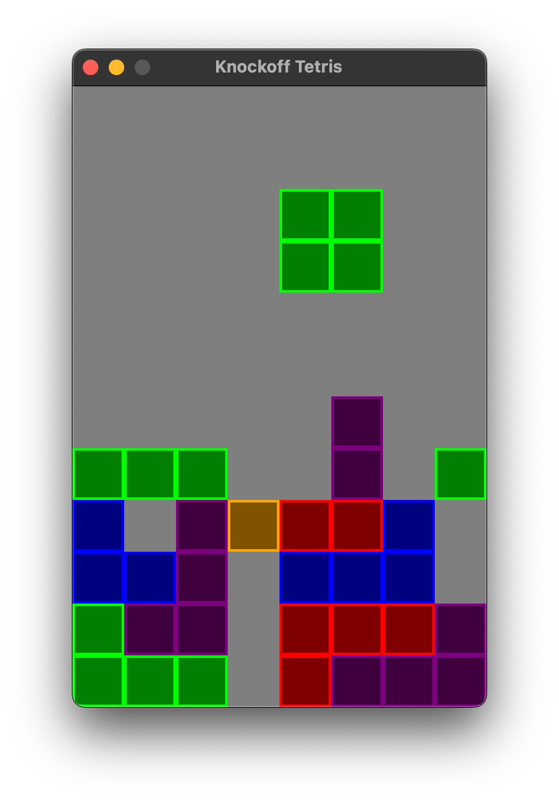

Knockoff Tetris
======

## About

This is clone of Tetris (with a much simplified rotation system), written in Rust using the Bevy engine. The purpose of this program is twofold:

- Learn the Rust programming language
- Familiarize myself with the Bevy game engine
- Play around with different code organization

Features implemented:
- System for specifying kicks for blocks
- Soft-dropping
- Lock delay

Features not yet implemented:

- Kicks as performed by the SRS (Super Rotation System)
- Random-from-a-bag picking of the next Tetromino
- Any scorekeeping
- Game-over detection
- Ghost-pieces (preview where a piece will drop)
- Pieces other than L, J, O, I
- Kicks for I are weird due to rotating around the center of a cell, rather than a corner

## Controls

- `A` - rotate left
- `D` - rotate right
- `< LEFT` / `RIGHT >` - move block
- `DOWN v` - soft-drop block
- `SPACE` - (for debugging) - pause / unpause block dropping

## Building

```bash
cargo check
cargo run
```

## Screenshots
